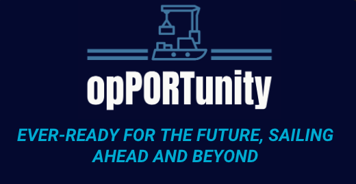

<p align="center">
  
</p>

# opPORTunity :ship:
[CHAMPION :trophy:] PSA Code Sprint Hackathon 2023 <br>
Team ByTheSea: https://www.psacodesprint.com/code-sprint-2023 <br>
 

## About :blue_book:
opPORTunity is a synergistic HR transformation portal that leverages the power of data, AI, and HR and has three key features: Talent, Experience, and Engagement. 

1. PortBOT :robot: [Talent] <br>
A dynamic virtual assistant that offers instantaneous support and conducts efficient resume reviews for potential candidates Within an organization, PortBot functions as a comprehensive internal knowledge hub for employees. <br>
[External Demo](https://port-bot.streamlit.app/) |
[Internal Demo](https://portbot-int.streamlit.app/) <br>
Note: Demos will be in sleep mode after a period of inactivity; notify me if you wish to try them out.
1. LightHouse 💡 [Experience] <br>
LightHouse utilizes AI-driven talent matching and dynamic skill profiling to personalize development roadmaps for each individual. Each team member receives tailored advice for their career growth.
1. PortConnections 🚢 [Engagement] <br>
Fostering engagement through the use of an AI recommendation engine to match employees and have them participate in diverse, budget-friendly activities that encourage cross-departmental connectivity. These activities are generated by matching the preferences of the group of matched employees.

### Team Members :busts_in_silhouette:

- [Xavier

## Tech Stack
- Vue.js
- StreamLit
- FastAPI
- LangChain
- ChromaDB
- OpenAI API

### Create `.env` file at the root directory:
```
MYSQL_ROOT_PASSWORD=root
MYSQL_DATABASE=bts_db_mysql
MYSQL_USER=bts_user
MYSQL_PASSWORD=bts_password
PHPADMIN_HOST=bts_db_mysql
PHPADMIN_USER=bts_user
PHPADMIN_PASSWORD=bts_password
OPENAI_API_KEY= ***OpenAI API key***
```
## Setup
### 1. Go to the server directory:
```
python3 -m venv venv
source venv/bin/activate #For windows: venv\Scripts\activate.bat
pip install -r requirements.txt
```

### 2. Exit virtual environment by using a new terminal

### 3. Go to Root directory
### 4. Run Docker:
First build the image:
```
docker-compose build
```
When ready, run it:
```
docker-compose up
```
Close docker
```
docker-compose down -v
```

### 5. To run frontend locally, at the client directory:
```
npm install
```
```
npm run dev
```
